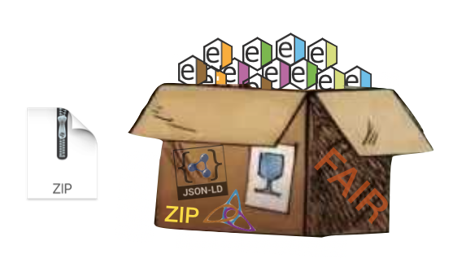
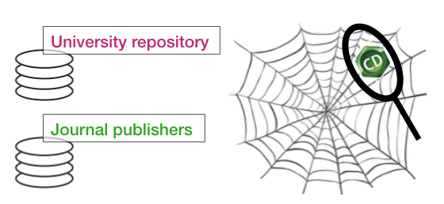
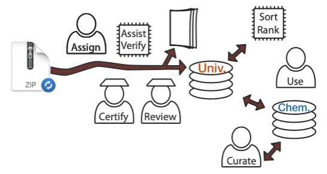
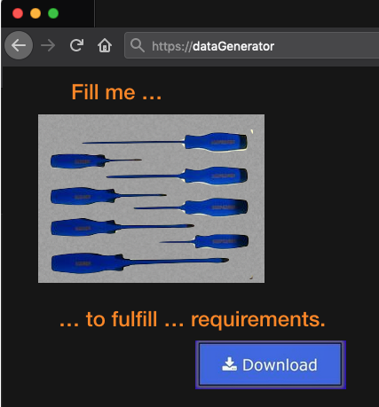

# Goal and scope
The goal of the CHEMeDATA Initiative is to improve the quality of chemistry data generated in support of scientific discoveries.
<!--- <h3 style="background-color:DodgerBlue;">This website is under construction</h3> ---> 

The Initiative is focusing on the problem of archive files, usually .zip files including chemistry data. These are generated by chemists to fulfill the **requirement of funding agencies** to make the outcome of their research available. These files are typically submitted as supplementary data when publishing scientific articles or stored on repositories such as [Zenodo](https://zenodo.org/), [Figshare](https://figshare.com/), or university repositories such as [Yareta](https://yareta.unige.ch/#/home) for the [University of Geneva](https://www.unige.ch/), *etc.*
	

We are addressing the questions of how to make the content of these .zip files [FAIR](https://en.wikipedia.org/wiki/FAIR_data)? In other words: How to make the chemistry-rich contents Findable, Accessible, Interoperable and Reusable.

### For example ...

Let's be specific and say that you want to share the 1D 1H spectrum of a compound you analysed. First, it has to be ***accessible***: be somewhere on the web. But making it reliably ***findable*** using common web search tools or *via* specialized chemistry data services is more difficult. It cannot be a simple link to a dropbox for example, but should be saved in an data repository. Usually providing DOI is a sign of stability. But even there, how will a search engine know that there is an NMR spectrum there, and know to what compounds it corresponds to?

Organized metadata such as *linked data* will make the spectrum and the compound visible to search engines. You will need [tools](tools) to make this automatically (so that you don't have to know what linked data are)! This will also allow others to easily cite your work when they (re)use your data.

# The CHEMeDATA Initiative involves ...

- **Making recommendations** to all stakeholders of the chain of data (from chemistry to database providers). 

For example, chemists should know that structure files (.cdx, .mol, *etc.*) are extremely important to make any data involving organic compounds computer understandable. Instructions for authors submitted articles to specialized journals should should mention it in the instructions to the authors submitting *supplementary chemistry information*, or even better, provide tools to generate exemplary data (see next point).

- **Making guidelines** for the creators of [tools](tools) to generate fair data

A well designed data generation [tool](tools) can replace wordy *Instructions for authors*. (A project to lay the ground of such a tool has been submitted in Nov. 2020 to a swiss [Open Research Data Hackathon](https://www.ord-hackathon.ch/) taking place in early 2021.) 

- **Initiate a culture of curation** of one's own public data. 
Platform dedicated to [curation](curation) of one's own, or other's data should be developed.
- **Support the creation of web platform to facilite the creation of FAIR chemistry data** from pre-computer era publications (scientific articles, thesis, books, websites, *etc.*). A PhD student should be able to associate the structure files (.mol) of the compounds he identified in a plant to his PhD.
- Interact with [IUPAC](https://iupac.org/projects/project-details/?project_nr=2016-023-2-300) to propose file format and best practice and test the implementation of envisioned recommendations. 

# How to make better chemistry data?

The supplementary data (typically .zip files) that are produced in association to publication or to fulfil the requirements of funding agencies to make data available can be improved. This is the key to make [FAIR](https://www.go-fair.org/fair-principles/) data!

- Recommendations for [chemists](chemists.md).
- Recommendations for [publishers](publishers.md) of chemistry journals.
- Recommendations for [chemistry data providers](data_provider.md) (University repositories, Journal editors, etc.).
- Recommendations for [developers of new solutions](developer.md) for chemistry.

<!---
[t](test_html_javascritp.html) 
---> 

# Technical information

We shall recommend using *linked data*, as a manner to facilitate the use of any existing ontologies, for author, institution, funding, and key *Chemistry objects*. These *linked data* may be enclosed in [RO-crate](http://www.researchobject.org/ro-crate/) frames.
Tools generating chemistry archives may directly use these format, or any other XML with accessible schema with appropriate data to allow for the generation of more "searchable" standards.

### General recommendations

- Include the crude/original data (chemdraw files, log files from commercial software, spreadsheets, spectra in the spectrometers format, pictures, etc.) in archive files.
- Include a FAIR version of these data (tools may need to be developed to add them - typically convert .cdx into .mol, generate Jcamp spectra, etc.). This should be mandatory when the data are in in any software specific and their files cannot be converted to open format by software freely accessible to the community.
- Include assignment data: the annotation/extracted information/scientific data obtained from these crude data (peak-picking, etc.) See NMReDATA Initiative.
- Include metadata about the author, instruments, date, link to journal articles, etc. (IUPAC will be requested to make recommendations.)

**To be called CHEMeDATA the data should fulfil some requirement with respect to openness (free access of the content).**

CHEMeDATA is the umbrella organization combining efforts by diverse communities addressing the FAIRness and chemistry data in a similar (and yet-to-be clearly defined) manner. It is spinoff of the [NMReDATA Initiative](https://www.nmredata.org), inheriting its general principles.

### Format for chemistry data

One of the activities of the CHEMeDATA Initiative is to encourage the development of standards to report information extracted from crude data (when such format is not already existing). For example, the [assignment of NMR spectra](https://nmredata.org/), IR spectra, etc. Extract the relevant information from the output of chemistry software, *etc.*)

Currently only the NMR community is a part of the CHEMeDATA Initiative via the [NMReDATA Initiative](https://nmredata.org/). Their main outcome is a format to associate the NMR assignment of an organic compound to a chemical structure file. This is done using so-called "tags" included in .sdf files, the latter being  compatible with the commonly used .mol format.

Potential developments:
- Produce a format for the assignment of other types of spectroscopies and analytical methods. For example, [IR assignment](https://chemedata.github.io/IReDATA/) could also be stored using the SD format. 

### Funding

From Oct. 2019 to Nov. 2020, the funding of Damien Jeannerat was covered by a 20% activity at the [DLCM](https://www.dlcm.ch/)/[E-research](https://www.unige.ch/eresearch/en/) group at the University of Geneva.
Since the  

### How to participate?
If you have comment, suggestions, contributions, *etc.* raise an [Issue on Github](https://github.com/CHEMeDATA/CHEMeDATA.github.io/issues).
