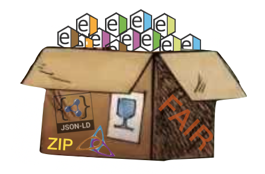

## Goal and scope
The main goal of the CHEMeDATA Initiative is to improve the quality of chemistry data in publications and databases.
<!--- <h3 style="background-color:DodgerBlue;">This website is under construction</h3> ---> 

We are considering, in particular, the problem of archive files, usually .zip files including chemistry data. These are generated by chemists to fulfill the requirement of funding agencies to make the outcome of their research available. These files are typically submitted as supplementary data when publishing scientific articles or stored on repositories such as [Zenodo](https://zenodo.org/), [Figshare](https://figshare.com/), or university repositories such as [Yareta](https://yareta.unige.ch/#/home) for the [University of Geneva](https://www.unige.ch/), etc.

We are adressing the question of how to make these .zip files including chemistry data [FAIR](https://en.wikipedia.org/wiki/FAIR_data)? In other words: How to make them their content Findable, Accessible, Interoperable and Reusable.

More specifically, how to make, say, the 1D 1H spectrum of a compound synthetized during a PhD, easily findable with common web search tools, or *via* other specialized chemistry data service.

This involves:
- Making recommendations to all stakeholders of the chain of data (from chemistry to database providers).
- Making guidelines for the creators of tools to generate fair data. 

### General recommendations

- Include the crude/original data (chemdraw files, log files from commercial software, spreadsheets, spectra in the spectrometers format, pictures, etc.) in archive files.
- Include a FAIR version of these data (tools may need to be developed to add them - typically convert .cdx into .mol, generate Jcamp spectra, etc.). This should be mandatory when the data are in in any software specific and their files cannot be converted to open format by software freely accessible to the community.
- Include assignment data: the annotation/extracted information/scientific data obtained from these crude data (peak-picking, etc.) See NMReDATA Initiative.
- Include metadata about the author, instruments, date, link to journal articles, etc. (IUPAC will be requested to make recommendations.)

**To be called CHEMeDATA the data should fulfil some requirement with respect to openness (free access of the content).**

CHEMeDATA is the umbrella organization combining efforts by diverse communities addressing the FAIRness and chemistry data in a similar (and yet-to-be clearly defined) manner. It is spinoff of the [NMReDATA Initiative](https://www.nmredata.org), inheriting its general principles.

### Format for chemistry data

One of the activities of the CHEMeDATA Initiative is to encourage the development of standards to report information extracted from crude data (when such format is not already existing). For example, the [assignment of NMR spectra](https://nmredata.org/), IR spectra, etc. Extract the relevant information from the output of chemistry software, *etc.*)

Currently only the NMR community is a part of the CHEMeDATA Initiative via the [NMReDATA Initiative](https://nmredata.org/). Their main outcome is a format to associate the NMR assignment of an organic compound to a chemical structure file. This is done using so-called "tags" included in .sdf files, the latter being  compatible with the commonly used .mol format.

Potential developments:
- Produce a format for the assignment of other types of spectroscopies and analytical methods. For example, [IR assignment](https://chemedata.github.io/IReDATA/) could also be stored using the SD format. 

### How to make better chemistry data?

The supplementary data (typically .zip files) that are produced in association to publication or to fulfil the requirements of funding agencies to make data available can be improved. This is the key to make [FAIR](https://www.go-fair.org/fair-principles/) data!

- Recommendations for [chemists](chemists.md).
- Recommendations for [publishers](publishers.md) of chemistry journals.
- Recommendations for [chemistry data providers](data_provider.md) (University repositories, Journal editors, etc.).
- Recommendations for [developers of new solutions](developer.md) for chemistry.

<!---
[t](test_html_javascritp.html) 
---> 
### How to participate?
If you have comment, suggestions, contributions, *etc.* raise an [Issue on Github](https://github.com/CHEMeDATA/CHEMeDATA.github.io/issues)
