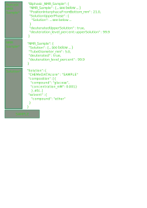

Illustration of the derivation of ontological concepts. The *types* are more and more specific when moving up the column.

The "*Solution*" type refers to concept of **Sample** and list some properties about the solvent and the solutes.

The "*NMR sample*" type refers to concept of *Solution*, derives it by adding more properties (about deuteration and the NMR tube).

The user-defined "*Biphasic NMR sample*" type refers to concept of *NMR sample*, derives it adding more properties to describe the two regions. Alternative definitions could start from the "Solution", this is up to the user to extend the schema tree as he likes.

