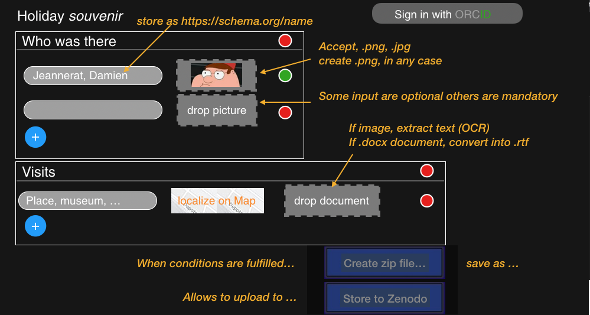

# Generation of good data
This page is not about chemistry only. It addresses the general problem of the generation of "good" archive data.

## Goal 
Facilitate the generation of structured archived files (.zip) by researchers. It will use domain-specific (or journal-specific) template to make it clear what data are mandatory, optional, etc. It will generate linked data for these files, but also about the author, related publication, *etc.*
## Problem
Currently scientists structure their files differently and include no field-specific metadata in the .zip files.
## To do
Create a generic web-based front-end tool reading a template to make a field-specific archive (probably using node.js). 
Key features: The archive forger would show pre-defined file-drop area, check the format of the files, allow to include comments, reference, and facilitate the generation of links between files (workflow, pairs, etc.). At the bottom of the page a "Generate Archive file" would create the .zip file.
## Format conversion
The tool could include file-format converters. This will allow proprietary file format to be the included in archive and still insure the "interoperability" through the presence of an additional file in an "open" format.
## Data pre-visualization
Previsualization would faciliate the verification that the files are organized correctly withing the page. (Show the content of the file instead of only its name.)
## Data validation
Some data types could be validated (say check NMR chemical shifts, or number of carbon signals). This will add value to the data submission process by providing the user with insurance that his analysis is correct. These may also increase the confidence of re-users of the data if the validation data are stored in the archive. 
## Direct submission
The tool could allow for the direct deposition to a repository such as Zenodo, Olos, FigShare, *etc.* or to scientific journal’s manuscript submission systems.
